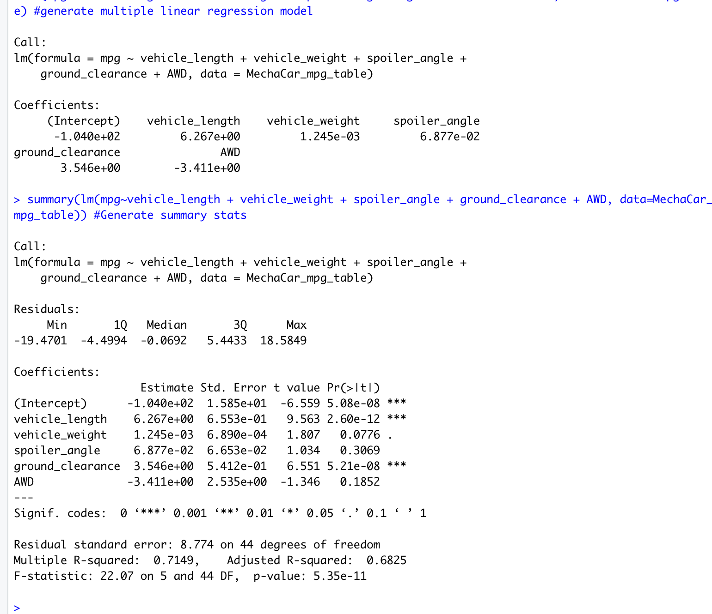

# MechaCar_Statistical_Analysis
## Overview of Analysis
## Linear Regression to Predict MPG
* The vehicle length and ground clearance variables are statistically unlikely to provide random amounts of variance to the linear model. This means that they have a significant impact on MPG. I concluded this by looking at the Pr(>|t|)  which represents the probability that each coefficient contributes a random amount of variance. Both vehicle length and ground clearance have very small values. 
* The slope of the linear model is not considered to be zero. I know this because the P-Value = 5.35e-11. This is much less than .05 and given the the significance level is .05%, we would reject the null hypothesis. 
* The linear model does predict mpg of MechaCars effectively. The R-sqaured value is .7149 which indicates that toughly 71% of all mpg predictions will be correct when using this linear model. 
*See below for the linear regression output*

