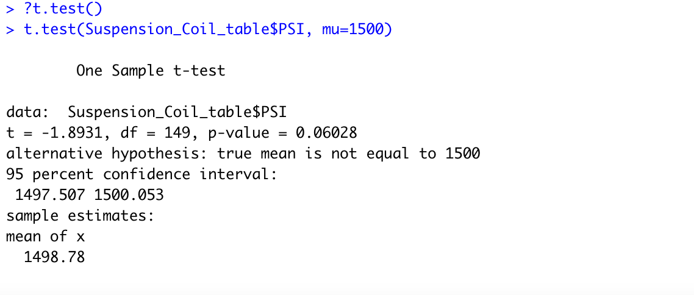

# MechaCar_Statistical_Analysis
## Overview of Analysis
## Linear Regression to Predict MPG
* The vehicle length and ground clearance variables are statistically unlikely to provide random amounts of variance to the linear model. This means that they have a significant impact on MPG. I concluded this by looking at the Pr(>|t|)  which represents the probability that each coefficient contributes a random amount of variance. Both vehicle length and ground clearance have very small values. 
* The slope of the linear model is not considered to be zero. I know this because the P-Value = 5.35e-11. This is much less than .05 and given the the significance level is .05%, we would reject the null hypothesis. 
* The linear model does predict mpg of MechaCars effectively. The R-sqaured value is .7149 which indicates that toughly 71% of all mpg predictions will be correct when using this linear model. 
*See below for the linear regression output*

## Summary Statistics on Suspension Coils
The design specifications for the MechaCar suspension coils state that the variance of the suspension coils must not exceed 100 pounds per square inch. In the total summary table I created, pictured below, we can see that the variance is 62.29. This would indicate that the suspension coils meet design specifiactions. 

However, when we group the data by the manufacturing lot we can see that lot 3 has a variance of 170.28 which would not meet the guidelines. Lots 1 and 2 have much lower variances suggesting that there is a skew in our data. 

## T-Tests on Suspension Coils
### T-Test for all lots
The first T-test that I conducted was used to determine if the PSI across all manufacturing lots is statistically different from the population mean of 1,500 pounds per square inch. This test resulted in p-value of .06 which is greater than the significance level of .05. Because of this we would fail to reject the null hypothesis that these are statistically similar. See below image for result

### T-Tests for individual lots
The next tests I conducted tested if the PSI of each manufacturing lot was statistically different from the population mean of 1500 pounds per square inch. In the image below we see that lot 1 resulted in a p-value of 1. We would again fail to reject the null that lot 1 and the population mean are statistically similar using the logic from above. 

The test for lot 2, shown below, resulted in a p-value of .6. This value is greater than .05, so we would fail to reject the null that lot 2 is statistically similar from the population mean. See below. 

The test for lot 3 resulted in a p-value of .04. Because .04 < .05 we would reject the null that they are similar. They would be different in this instance. 

## Study Design: MechaCar vs Competition
I am going to create an additional study that compares performance of the MechaCar vehicles against performance of vehicles from other manufacturers.
### What metric or metrics are you going to test?
I will be testing if there is a difference in the mean of maintenance cost for MechaCar vehicles and the competition(population)
### What is the null hypothesis or alternative hypothesis?
Null : There is no statistical difference between the mean of the maintenance cost for MechaCar and the mean of the cost for the vehicles made by their comeptitors. 
Alternative: There is a statistical difference between the the mean of the maintenance cost for MechaCar and the mean of the cost for the vehicles made by their comeptitors. 
### What statistical test would you use to test the hypothesis? And why?
I would use a One-Sample T-test for this as we are testing dichotomous data types. (sample vs. population)
### What data is needed to run the statistical test?
We would need data on the cost of maintenance for the vehicles that MechaCar produces as well as the mean for the cost of maintenance of all vehicles. 
